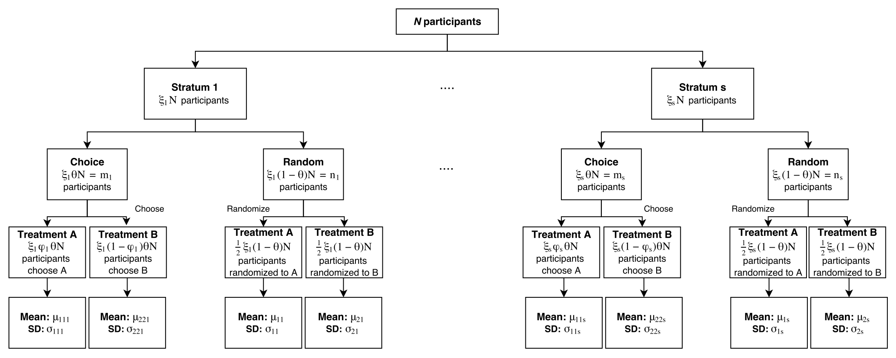

# Introduction

In the traditional clinical trial design, participants are randomized to a 
designated treatment arm with the express purpose of estimating the treatment 
efficacy.  However, this traditional design ignores the potential impact that 
an individual’s preference for a particular treatment may play on the overall 
effectiveness.  This impact can be of concern when participants are not 
blinded to the treatment arm, (e.g. diet and exercise interventions or medical 
versus surgical interventions).  The two-stage clinical trial design [[1](#section-references)], where 
patients are first randomized to a choice arm versus a random arm, allows for 
estimation of the standard treatment effect as well as a selection effect and 
a preference effect (see below for definitions).  From this design, the 
investigator is able to estimate how much choice of a preferred treatment can 
impact the effectiveness of a given treatment.

 

Figure 1: The Stratified Design [[2](#section-references)]

# Design Parameters

The following table presents a description and constraints for each of the parameters.
Note that setting the number of strata to one is equivalent to an unstratified design [[1,5](#section-references)]

Parameter | Description | Parameter Constraints
----------|-------------------------------- | ------------------
$N$ | Total samples in the trial | Should be greater than 0 
$s$ | Number of strata | $s > 0$
$\xi_i$ | Proportion of individuals in strata $i$ | $\sum_{i=1}^s \xi_i = 1$
$n$ | Individuals in the random arm | $n \leq N$
$m$ | Individuals in the choice arm | $m + n = N$
$\Theta$ | Proportion sample size distributed to the choice arm[4] | $\Theta N=m$, $(1-\Theta)N=n$
$n_i$ | Individuals in the $i$th random-arm strata | $\sum_{i=1}^s n_i = n$
$m_i$ | Individuals in the $i$th choice-arm strata | $\sum_{i=1}^s m_i = m$
$\phi_i$ | The preference rate of treatment 1 in stratum $i$ | $m_i / m$ 
$m_{ij}$ | Choice arm individuals receiving treatment $j$ in stratum $i$ | $\sum_j m_{ij} = m_i$
$n_{ij}$ | Random arm individuals assinged treatment $j$ in stratum $i$ | $\sum_j n_{ij} = n_i$
$\mu_{jji}$ | Choice arm mean outcome for treatment $j$ in stratum $i$ | 
$\sigma^2_{jji}$ | Choice arm oucome variance for treatment $j$ in stratum $i$ | 
$\mu_{ji}$ | Random arm mean outcome for treatment $j$ in stratum $i$ | 
$\sigma^2_{ji}$ | Random arm oucome variance for treatment $j$ in stratum $i$ | 

# An Example Trial

# Design Your Own Trial

- Selection Effect
    - Power 
    - [Sample Size](../stratified-sample-calculator)
- Preference Effect
    - Power 
    - Sample Size
- Treatment Effect
    - Power 
    - Sample Size
- All Three Effects Simultaneously
    - Power 
    - Sample Size
- Effect Size Calculator

# Definitions

SELECTION EFFECT: The effect on outcomes from the self-selection of individuals into a particular treatment [[1,3](#section-references)].  This effect captures differences in outcomes between those preferring treatment A and those preferring treatment B.

PREFERENCE EFFECT: The effect on outcomes from receiving the preferred treatment [[1,3](#section-references)]. This effect looks at differences in outcomes between participants receiving their preferred treatments and participants who do not receive their preferred treatment.

# References

1.	Rucker G. A two-stage trial design for testing treatment, self-selection and treatment preference effects. Statistics in Medicine 8:477-485 (1989).
2.	Cameron B, Esserman DA. Sample size and power for a stratified doubly randomized preference design. _Statistical Methods in Medical Research_ Nov 21. pii: 0962280216677573. [Epub ahead of print] (2016).
3.	McCaffery KJ, Turner R, Macaskill P, Walter SD, Chan SF, Irwig L. Determining the impact of informed choice: separating treatment effects from the effects of choice and selection in randomized trials. _Medical Decision Making_ 31(2): 229-236 (2011).
4.	Walter SD, Turner RM, Macaskill P, McCaffery KJ, Irwig L. Optimal allocation of participants for the estimation of selection, preference, and treatment effects in the two-stage randomized trial design. _Statistics in Medicine_ 31(13) 1307-22 (2012).
5.	Turner RM, Walter SD, Macaskill P, McCaffery KJ, Irwig L. Sample size and power when designing and randomized trial for the estimation of treatment, selection and preference effects. _Medical Decision Making_ 34(6) 711-9 (2014).

