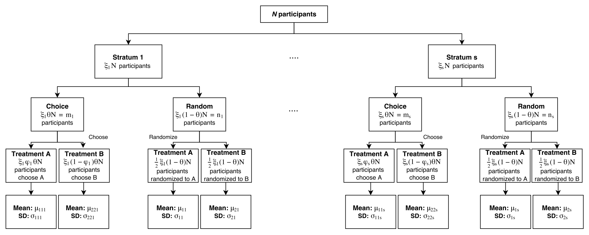

<!--
%\VignetteEngine{knitr::rmarkdown}
%\VignetteIndexEntry{The preference Package Vignette}
-->


# Introduction

The ```preference``` package provides tools for the design and analysis of [two-stage randomized trials](https://www.ncbi.nlm.nih.gov/pubmed/2727471), which can be used to determine the impact of a patient's treatment preference on his or her treatment response. In this trial, patients are first randomized to either a random or choice arm. Patients initially randomized to the choice arm are allowed to choose their preferred treatment from the available options, while patients initially randomized to the random arm will undergo a second randomization to one of the available treatment options. This trial has also been extended to allow for important [stratification variables](https://www.ncbi.nlm.nih.gov/pubmed/27872194); the functions available in the ```preference``` package can accomodate both the unstratified and stratified designs.

In this study, there are three effects that may be of interest. The treatment effect captures the difference in outcome between patients randomized to treatment A and treatment B (similar to a traditional RCT). The selection effect captures the difference in outcome between patients that prefer treatment A and patients that prefer treatment B, regardless of the treatment that is actually received. Finally, the preference effect compares the outcomes of patients who receive their preferred treatment (either treatment A or treatment B) and patients who do not receive their preferred treatment.

The schematic and notations of the stratified two-stage randomized design is shown below.



Note, $N$ represents the total number of patients enrolled in the study and $\xi_l$ represents the proportion of patients in stratum $l$ ($l=1,...,s$) with $\sum_{l=1}^s \xi_l=1$ ($\xi_1=1$ for unstratified design). We also define $\theta$ to be the proportion of patients randomized to the choice arm with $m_l$ representing the sample size of the choice arm in stratum $l$ and $n_l$ representing the sample size of the random arm in stratum $l$. In the choice arm, we assume that $m_{ii}$ patients choose treatment $i$ and that the mean response of these patients is $\mu_{iil}$ (with standard deviation $\sigma_{iil}$). In the random arm, $n_{il}$ patients are randomized to treatment $i$; we use $\mu_{il}$ and $\sigma_{il}$ to represent the mean and standard deviation of the responses in this arm. Finally, we use $\phi_l$ to represent the propotion of patients preferring treatment A in stratum $l$.


# Installing the package

To install and load the package, run the following code:

```{r,message=F,warning=F}
if (!require(devtools)) install.packages("devtools", repos="https://cloud.r-project.org")
library(devtools)
install_github("kaneplusplus/preference")
library(preference)
```

# Design a two-stage randomized trial

To illustrate the use of the ```preference``` package, we will use the [IMAP study](https://www.ncbi.nlm.nih.gov/pmc/articles/PMC2827716/) as an example. In this study, a two-stage randomized design was used to evaluate the role of patient preferences in the context of managing abnormal Pap smears in women. Two different approaches to the management of abnormal Pap smear findings were evaluated, (1) standard management. i.e. repeated Pap testing every 6 months to monitor for more serious abnormalities; and (2) use a human papilomavirus (HPV) triage approach, which tests for the presence of HPV types that are associated with an increased risk of cervical cancer. The investigators were interested in determining the imapct of informed choice on psychosocial outcomes, including health-related quality of life (HRQoL) and satisfaction. For this example, we assume that health-related quality of life, as measured by the mental component subscore (MCS) of the SF36, is the primary outcome of interest. 

While the original study was not stratified, the design and analysis of a stratified two-stage randomized study can be illustrated by considering the six item abbreviated state trait anxiety inventory ([STAI](https://www.ncbi.nlm.nih.gov/pubmed/1393159#)) as a stratification factor. The STAI score is a measure of anxiety, with higher scores indicating higher levels of anxiety. Because the HPV triage approach is a generally speedier option, we may expect that a greater proportion of women with high levels of anxiety will prefer this approach. Women were classified as having high or low anxiety based on STAI score (with a cutoff value of 10).

Note, summary data for the IMAP trial is contained in the ```imap``` object within the ```preference``` package (stratified summary data is available in the ```imap_strat``` object). 

## Sample Size

### Unstratified design

Suppose we wish to establish the [required sample size](https://www.ncbi.nlm.nih.gov/pubmed/24695962) to determine the effect of choice on SF36 MCS in the IMAP study.  First, we need to define the size of the preference, selection, and treatment effects we expect to see in the study. If the effect sizes are known, these effect sizes are used directly in the ```overall_sample_size``` function. If not, the function ```effects_from_means``` can be used to compute these effects from the means of each treatment group in both the choice and random arm. 

In the IMAP study, we may expect the HCV triage method to result in only a small increase in SF36. Therefore, we might expect women randomized to the HCV triage method to have a mean SF36 score of 46 ($\mu_1$), while women randomized to repeated Pap screening are expected to have a mean SF36 score of 45 ($\mu_2$). In the choice group, we expect the mean SF36 score to increase by 4 points in both management groups. Therefore, we assume that women choosing the HCV triage method to have a mean score of 50 and women choosing the repeated Pap smear management option to have a mean SF36 of 49. In addition, we must specify the proportion of women preferring the HPV triage management method. Because management with an HPV triage approach is generally a speedier option, we expect 70% of women to prefer this approach, as compared to the 30% of women who would prefer management with repeated Pap smears. With these assumptions, we can calculate the preference, selection and treatment effects.

```{r}
effects_from_means(mu1=46, mu2=45, mu11=50, mu22=49, phi=0.7)
```

Therefore, with the mean SF36 scores assumed above, we need to design a study to detect a treatment effect of 1, selection effect of 3.81, and a preference effect of 9.52. To determine the necessary sample size, we must also specify the variance of the responses. In this example, we assume a variance of 5 for the SF36 outcome. Then, the sample size to detect the above effects with 80% power and a Type I error of 0.05 is given by the ```overall_sample_size``` function. (Note, the ```selection_sample_size```, ```preference_sample_size```, and ```treatment_sample_size``` functions can be used to find the sample size if only one of the selection, preference, or treatment effects is of interest).

```{r}
overall_sample_size(power=0.8, phi=0.7, sigma2=5, delta_pi=9.52, delta_nu=3.81, delta_tau=1)
```

Selecting the largest of these three sample sizes, we would need a study of 314 patients to detect the effects given above.  Note, in analysis, if all three of these effects were of interest, the type I error rate would need to be adjusted to account for multiple testing.

### Stratified Design

We may also be interested in stratifying for STAI score (low vs high) in our study. Because women with low STAI scores have decreased anxiety, we expect women in this stratum to have improved SF36 compared to women in the high STAI stratum. Therefore, we expect women randomized to HCV triage with low STAI scores to have a mean SF36 of 52, while women randomized to HCV triage with high STAI scores to have a mean SF36 of 42. In addition, we assume that women randomized to repeated Pap screening will have a mean SF36 of 50 in the low STAI stratum and a mean SF36 of 42 in the high STAI group.

In the choice arm, we expect both strata to have a small increase in SF36 across both management systems. For the low STAI group, we expect a 2 point increase in mean SF36 for both management groups. In the high STAI group, we also expect a 2 point increase in mean SF36 for women choosing repeated Pap screening. Because the HCV triage method is a speedier approach, we expect a slightly greater increase in SF36 for women in the high STAI group choosing this method; we assume a mean SF36 score of 46 for this group.
 
Finally, we assume that both management systems will be equally preferable to women in the low STAI stratum ($\phi_1, \phi_2=0.5$). Because women with high STAI score have increased anxiety, we may expect a greater proportion of these women to prefer the HPV triage management method, which is the speedier option. Therefore, we assume that 70% of the women in the high STAI stratum will prefer HPV triage, and only 30% will prefer repeated Pap screening. Furthermore, we assume that 40% of women will have low STAI scores and 60% of women will be in the high STAI score stratum. Based on these assumptions, we can calculate the preference, selection and treatment effects we wish to test in our study.

```{r}
effects_from_means(mu1=c(52,42), mu2=c(50,42), mu11=c(54,46), mu22=c(52,44), phi=c(0.5,0.7), nstrata=2, xi=c(0.4,0.6))
```

With the assumptions listed above, we will need to design a study that can detect an overall treatment effect of 1, selection effect of 3.67, and preference effect of 7.67. We also need to specify the variance of the responses. We assume a variance of 3 for the SF36 outcome in the low STAI stratum and a variance of 4 in the high STAI stratum. With 80% power and a Type I error rate of 0.05, we can use the ```overall_sample_size``` function to find the sample size needed to detect the above effect.

```{r}
overall_sample_size(power=0.8, phi=c(0.5,0.7), sigma2=c(3,4), delta_pi=7.67, delta_nu=3.67, delta_tau=1, xi=c(0.4,0.6), nstrata=2)
```

In the two-stage randomized design stratified by STAI score, we would need an overall sample size of 227 patients.

## Power

Alternatively, we may have a pre-specified number of women to be enrolled and instead want to know the power of our study to detect each effect.

### Unstratified Design

Assume that we plan to enroll 212 women in the study. If we assume the same preference, treatment, and selection effects as above and make the same assumptions regarding the preference rate and response variance, we can use ```overall_power``` to estimate the study power, assuming a Type I error of 0.05. (Note, the ```selection_power```, ```preference_power```, and ```treatment_power``` functions can be used to find the power if only one of the selection, preference, or treatment effects is of interest).

```{r}
overall_power(N=212, phi=0.7, sigma2=5, delta_pi=9.52, delta_nu=3.81, delta_tau=1)
```

With a sample size of 212, we would have 63% power to detect a treatment effect of 1, 100% power to detect a preference effect of 9.52, and 78% power to detect a selection effect of 3.81.

### Stratified Design

We may also wish to know our study power for a two-stage randomized trial stratified by STAI score with 212 patients. We will continue to assume that we wish to detect a treatment effect of 1, selection effect of 3.67, and preference effect of 7.67 and retain the assumptions above regarding the variance and preference rate within each stratum.

```{r}
overall_power(N=212, phi=c(0.5,0.7), sigma2=c(3,4), delta_pi=7.67, delta_nu=3.67, delta_tau=1, xi=c(0.4,0.6), nstrata=2)
```

Therefore, a stratified design with an overall sample size of 212 will have 77% power to detect a treatment effect of 1, 100% power to detect a preference effect of 7.67, and 93% power to detect a selection effect of 3.67.

## Distribution between choice and random arms

In the examples presented above, we have assumed $\theta$, the proportion of individuals that are distributed to the choice arm, to be 0.5 (equal distribution). In general, however, $\theta$ is not a fixed parameter and can be specified according to the main goals of the study. If a desired $\theta$ is known in advance, the user can directly set this argument in the function calls above. If the desired $\theta$ is not known, the function ```optimal_proportion``` can be used to estimate the [optimal value](https://www.ncbi.nlm.nih.gov/pubmed/22362374)optimal value given a the goals of a particular study.

To use ```optimal_proportion```, a set of weights must be defined that indicate the relative importance of estimating each of the three effects (```w_sel```, ```w_pref```, ```w_treat```) with the constraint ```w_sel```+```w_pref```+```w_treat```=1. For example, if we are equally interested in estimating the selection, preference, and treatment effects, we would assign a weight of $\frac{1}{3}$ to each effect (i.e. ```w_sel```=```w_pref```=```w_treat```=0.33). If we want to determine the optimal $\theta$ for the unstratified IMAP example above to detect a preference effect of $\Delta\pi=9.52$ and a selection effect of $\Delta\nu=3.81$ (assuming 70% of women prefer the HCV triage method and a variance of 5), we can use the following function call.

```{r}
optimal_proportion(w_sel=1/3, w_pref=1/3, w_treat=1/3, sigma2=5, phi=0.7, delta_pi=9.52, delta_nu=3.81)
```

Therefore, if we are equally interested in the estimation of the preference, selection, and treatment effects, we should allocate 64% of patients to the choice arm in the initial randomization stage.

Note, this function is only available for the unstratified design at this time.

# Analyze a two-stage randomized trial

## Analysis using summary data

### Unstratified Design

Summary data for the primary outcome, SF36 MCS, is provided in the ```imap``` data frame within the ```preference``` package.

```{r}
imap
```

The ```mean``` and ```sd``` columns indicate the mean and standard deviation of the SF36 MCS for each study group. The treatment (HPV triage or repeated Pap screening) is indicated in the ```trt``` column, and the study arm (choice or random) is indicated in the ```arm``` column.

To calculate the observed preference, selection and treatment effects, we can again use the ```calc_effects``` function.

```{r}
effects_from_means(mu1=46.16386, mu2=45.51061, mu11=47.57283, mu22=50.58991, phi=50/(50+22))
```

The results indicate small treatment and selection effects, but a moderate 6 point increase in SF36 score resulting from preference effects. If we want to use this summary data to test the significance of the preference, selection and treatment effects, we can use the ```analyze_summary_data``` function. To use this function, we need to input the mean, variance, and sample size of each group.

```{r}
analyze_summary_data(x1mean=47.57283, x1var=10.6162889^2, m1=50, 
                     x2mean=50.58991, x2var=4.8686232^2, m2=22, 
                     y1mean=46.16386, y1var=9.7385777^2, n1=76, 
                     y2mean=45.51061, y2var=9.9744353^2, n2=64)
``` 

The output of this function provides the test statistic and p-value for each of these three effects. As was found in the [original study](https://www.ncbi.nlm.nih.gov/pubmed/21041538), none of these effects are statistically significant at a Type I error rate of 5%, although the preference effect is close to reaching this significance level with a p-value of 0.07.

### Stratified Design

Summary data for the stratified design is included in the ```imap_strat``` data frame. 

```{r}
imap_strat
```

The low STAI group is indicated by ```stratum=1```, and the high STAI group is indicated by ```stratum=2```.

The ```effects_from_means``` function can be used to calculate the observed preference, selection and treatment effects. Note, baseline STAI is missing for 4 of the 212 patients included in the original IMAP study. Therefore, the total sample size for the stratified data is 208.

```{r}
mu1=c(52.00437,42.17970)
mu2=c(53.84277,41.14614)
mu11=c(54.33376,41.00851)
mu22=c(51.50413,49.89651)
phi=c(24/(24+10),25/(25+11))
xi=c((24+10+30+22)/208,(25+11+44+42)/208)
effects_from_means(mu1, mu2, mu11, mu22, phi, nstrata=2, xi)
```

The results are similar to the unstratified case, in which small treatment and selection effects were observed with a moderate increase in SF36 due to preference effects. We can again use the ```analyze_summary_data``` function to test the significance of each effect.  In a stratified design, the mean, variance, and sample size of each stratum must be included, along with the number of strata and the proportion (```nstrata```) of  patients within each stratum (```xi```). 

```{r}
x1mean=c(54.33376,41.00851)
x1var=c(5.5, 10.5)
m1=c(24,25)
x2mean=c(51.50413,49.89651)
x2var=c(6.1, 3.8)
m2=c(10,11)
y1mean=c(52.00437,42.17970)
y1var=c(6.6, 9.6)
n1=c(30,44)
y2mean=c(53.84277,41.14614)
y2var=c(5.3,9.1)
n2=c(22,42)
xi=c((24+10+30+22)/208,(25+11+44+42)/208)
analyze_summary_data(x1mean, x1var, m1, x2mean, x2var, m2, y1mean, y1var, n1, y2mean, y2var, n2, xi, nstrata=2)
```

Again, we see that none of the effects are significant at a 5\% significance level, although the preference effect is close to reaching significance at $p=0.08$.

## Analysis using raw data

If we have access to raw study, we can use the ```analyze_raw_data``` function to compute the test statistics and p-values for each effect. This function requires the vector of responses for each treatment in the choice arm (```x1``` for choice arm patients choosing treatment A, ```x2``` for choice arm patients choosing treatment B) and the random arm (```y1``` for random arm patients receiving treatment A, ```y2``` for random arm patients receiving treatment B). In addition, the stratum membership of each group must be provided if the study is stratified. 

# References

Rucker G (1989). "A two-stage trial design for testing treatment, self-selection and treatment preference effects." Stat Med, 8(4):477-485. ([PubMed](https://www.ncbi.nlm.nih.gov/pubmed/2727471))

McCaffery et al. (2010) "Psychosocial outcomes of three triage  methods for the management of borderline abnormal cervical smears: an open  randomised trial." BMJ, 340:b4491. ([PubMed](https://www.ncbi.nlm.nih.gov/pmc/articles/PMC2827716/))

Walter et. al. (2011). "Optimal allocation of participants for the estimation of selection, preference and treatment effects in the two-stage randomised trial design." Stat Med, 31(13):1307-1322. ([PubMed](https://www.ncbi.nlm.nih.gov/pubmed/22362374))

McCaffery et al. (2011) "Determining the Impact of Informed Choice: Separating Treatment Effects from the Effects of Choice and Selectionin Randomized Trials." Med Decis Making, 31(2):229-236. ([PubMed](https://www.ncbi.nlm.nih.gov/pubmed/21041538)))

Turner RM, et al. (2014). "Sample Size and Power When Designing a Randomized Trial for the Estimation of Treatment, Selection, and Preference Effects." Medical Decision Making, \strong{34}:711-719. ([PubMed](https://www.ncbi.nlm.nih.gov/pubmed/24695962))

Cameron B, Esserman D (2016). "Sample Size and Power for a Stratified Doubly Randomized Preference Design." Stat Methods Med Res. ([PubMed](https://www.ncbi.nlm.nih.gov/pubmed/27872194))


